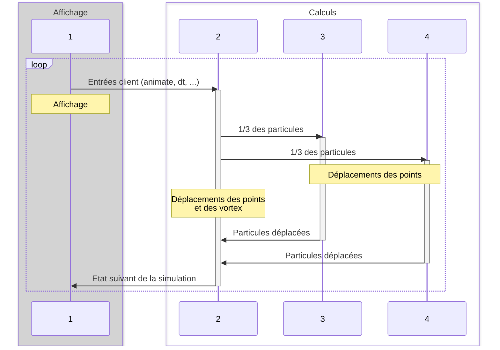
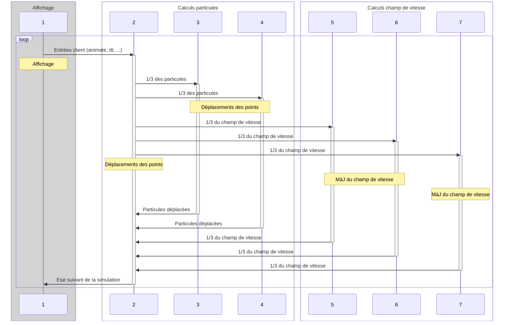

# Projet Ensta 2023

## Résultats

### Séparation interface-graphique et calcul

_Voir la branche sep-graphic-calculation_

Avant la parallélisation la simulation fonctionne environ à 45 FPS.
Après parallélisation, la fréquence d'image est plutôt de 40-42 FPS. Cela
peut paraitre contre intuitif (en dans un sens ça l'est), cependant il
est très important de noter que le processus graphique passe ~90% à
attendre les communications et communiquer avec le processus de calcul¹.
Je pense donc que cette perte de performance est due au fait que mon pc
étant plutôt puissant, le gain permit par la parallélisation est perdu
par le cout de communication entre les deux processus. Néanmoins, le
fait que le processus graphique passe beaucoup à attendre le calcul
permet de supposer qu'une meilleure parallélisation de ce dernier
permettra de gain de performance significatif : la marge d'amélioration
est forte².

¹De plus le benchmark n'a pas été réalisé au même moment, la charge du pc seule peut expliquer cette
variation.

²Théoriquement on peut espérer (au maximum) de diminuer le temps
pris par le processus graphique à `0.0233 * (1 - 0.9) = 0,0023` seconde soit 434 FPS !

### Parallélisation en mémoire partagée

_Voir la branche share-mem-parallelization_

Il y a globalement 5 boucles for dans les calculs :
1. Celles qui déplacent les points ([ici](https://github.com/Seb-sti1/ProjetEnsta2023/blob/main/src/runge_kutta.cpp#L15) et [là](https://github.com/Seb-sti1/ProjetEnsta2023/blob/main/src/runge_kutta.cpp#L44))
2. [Celle qui déplace les vortices](https://github.com/Seb-sti1/ProjetEnsta2023/blob/main/src/runge_kutta.cpp#L61)
3. [Celle qui les mets à jour](https://github.com/Seb-sti1/ProjetEnsta2023/blob/main/src/runge_kutta.cpp#L76)
4. [La boucle de calcul de vitesse en point](https://github.com/Seb-sti1/ProjetEnsta2023/blob/main/src/vortex.cpp#L10)
5. [Les deux boucles for pour mettre à jour le champ de vitesse](https://github.com/Seb-sti1/ProjetEnsta2023/blob/main/src/cartesian_grid_of_speed.cpp#L22)

Voici les temps moyens (en ms) de chacune de ces boucles for :

| boucle for (cf liste ci-dessus) | Pour simpleSimulation.dat | Pour manyVortices.dat |
|---------------------------------|---------------------------|-----------------------|
| #1                              | 20,318                    | 37,20                 |
| #2                              | 0,0013266                 | 0,00416               |
| #3                              | 0,0000028                 | 0,0000027             |
| #4 (testée indépendamment¹)     | 0,000112489               | 0,0002333             |
| #5                              | 2,268723                  | 4,938215              |

¹La boucle #4 étant utilisée dans certaines des autres boucles, il est obligatoire de ne pas la
modifier pour tester de manière fiable les autres boucles.

Il est clair qu'il serait bénéfique de paralléliser la boucle #1. Le temps de la boucle #5
s'explique à 100% par le temps pris par #4 (complexité en O(m_height * m_width * O(#4))). Concernant la
boucle #2 ~25% du temps est passée dans #4. Cependant, paralléliser la boucle #4 ne me
semble pas être une si bonne idée : il n'y a au maximum que 5 tourbillons. C'est aussi le cas de #2, et
le temps d'exécution de #3 est dérisoire pour qu'il soit utile de paralléliser la boucle.
**Finalement, je suis d'avis de paralléliser #1, #5.**

Pour OMP_NUM_THREADS=8, les nouveaux temps (en ms, speed entre parenthèse) sont :

| boucle for (cf liste ci-dessus) | Pour simpleSimulation.dat | Pour manyVortices.dat |
|---------------------------------|---------------------------|-----------------------|
| #1                              | 12,094 (168%)             | 24,083 (154%)         |
| #5                              | 1,9969 (113%)             | 4,7844 (103%)         |

L'amélioration sur la boucle #1 est notable ce qui n'est pas vraiment le cas pour #5.

**L'amélioration globale permet d'augmenter les FPS à ~70. Cependant, le processus
d'affichage passe toujours ~80% du temps à attendre et communiquer.**

### Parallélisation en mémoire distribuée et partagée des calculs

_Voir la branche mpi-calc_

Cette partie est probablement la plus complexe à implémenter. Voici la manière dont je
vais organiser les communications :

Il est important de noter que pour cette partie, il faudrait utiliser un réseau
d'ordinateur pour que le parallélisme puisse avoir assez de thread, coeurs
et processeurs.

Cela étant dit, pour 4 threads OMP et 4 processus MPI, il y a tout
de même un gain de performance : On avoisine les 145 FPS ! Le processus
d'affichage ne passe plus que ~50% du temps à attendre les communications
et communiquer. Le temps total de calcul est d'environ 62ms.

### Réflexions sur l'approche mixte Eulérienne--Lagrangienne

Pour cette partie, on garde les processus dédiés aux calculs des particules
et on ajoute des processus pour calculer le champ de vitesse. Préalablement, il
faudra que chaque processus reçoive les vortex déplacés puis calcule une partie
de la grille. J'aurais implémenté les communications de la manière suivante :

- Que se passe-t-il dans le cas d'un maillage de très grande dimension avec la ou les solutions que vous proposez ?

Dans ce cas, il faudra adapter le nombre de processus dédié aux calculs de
déplacement des particules pour que les calculs de champ de vitesse
aient plus de processus. Cela permettra de garantir que le calcul de déplacement
de particules et du champ de vitesse terminent en même temps.

- Que se passe-t-il dans le cas d'un très grand nombre de particules ?

Dans ce cas, on peut faire l'inverse : réserver plus de processus pour
le calcul de particules et moins pour le champ de vitesse.

- Et dans le cas d'un maillage de très grande taille **ET** un très grand nombre de particules ?

C'est le cas où la charge est la plus lourde. Je ne vois pas d'optimisation
particulière faisable.

 

Dans tous les cas, il n'y a pas besoin de faire de recouvrement de domaine
car les calculs sont indépendants. Pour adapter le nombre de processus
dédié aux déplacements de particules et ceux dédiés au champ de vitesse,
il pourrait être intéressant d'évaluer les complexités et les temps d'execution.
Par exemple, sur mon ordinateur, les déplacements de particules prend environ
10 fois plus de temps que le calcul du champ de vitesse.

## Modélisation de tourbillons sur un tore en deux dimensions

Le projet consiste à optimiser et paralléliser un code simulant des tourbillons sur un tore en deux dimensions.

Un article ["vortical flow"](doc/vortical_flow1.pdf), en particulier le premier chapitre, décrit l'équation décrivant les vitesses générées par un tourbillon. Un tourbillon est décrit par deux paramètres :

- La coordonnée du centre du tourbillon
- L'intensité du tourbillon. Notons que si l'intensité est une valeur positive, le tourbillon tourne dans le sens direct, et si sa valeur est négative, le tourbillon tourne dans le sens indirect.

Le vecteur vitesse $v$ généré en un point $p$ par un tourbillon de centre $c$ et d'intensité $K$ est :

- Tangentiel au cercle de centre $c$ et de rayon $\vec{r}=\vec{cp}$, soit de direction $\vec{d} = \left( -r_{y}; r_{x} \right)^{T}$
- et de module $\|v\| = \frac{|K|}{\|\vec{r}\|}$

On a donc $\vec{v} = \frac{K}{\|\vec{r}\|^{2}}*\vec{d}$.

Le tore est un rectangle dont les côtés opposés sont reliés. Cela revient à considérer le domaine comme *cyclique* ce qui implique qu'on devrait gèrer une infinité de tourbillons dans l'absolu. Cependant, il 
est important de noter que les vitesses générées ont un module en $\frac{1}{\|\vec{r}\|}$, si bien qu'il suffit pour une bonne approximation de ne gèrer que les tourbillons se trouvant dans les domaines adjacents comme illustré à la [figure 1](#fig1).

Ainsi, si un tourbillon est décrit dans la simulation, le champ de vitesse prend en fait en compte neuf tourbillons pour prendre en compte la topologie en tore du domaine de calcul.

|  |
|:--:|
| <b>Figure 1 : Équivalent calcul de la gestion du tore</b>|

Pour ceux curieux en mathématiques :

- Le schéma en temps utilisé est un schéma de Runge-Kutta d'ordre cinq explicite. Il offre une grande précision en temps mais devient instable pour des pas de temps supérieurs à 1.4. Pour chaque particule (et tourbillon si mobile) on doit effectuer trois estimations du déplacement par particule pour trouver l'interpolation d'ordre cinq à effectuer.
- Le calcul du déplacement des particules utilise le champ de vitesse calculé sur une grille cartésienne (et affiché dans la partie gauche de la fenêtre) en faisant une interpolation bi-cubique par rapport aux champs de vitesse voisins de la particule.

## Compilation du code

Installer la dépendance à la bibliothèque graphique utilisée :

    sudo apt install libsfml-dev

Compiler :

    make all

## Utilisation du code

L'exécutable attend trois paramètres :

- Le nom d'un fichier décrivant une simulation à exécuter
- La résolution de l'écran de visualisation (en nombre de pixels par direction, soit deux entiers)

Exemple :

    ./vortexSimulation data/simpleSimulation.dat 1280 1024

Plusieurs fichiers décrivant diverses simulations sont donnés dans le répertoire **data** :

 - **oneVortexSimulation.dat** : Simule un seul tourbillon placé au centre du domaine de calcul et immobile (il ne se déplace pas). Utile pour tester un cas simple en parallèle en testant uniquement le déplacement des particules (le champ de vitesse reste lui aussi statique);
 - **simpleSimulation.dat** : Simule deux tourbillons contra-rotatifs et mobiles. Utile pour tester un cas simple en parallèle avec un champ de vitesse instationnaire;
 - **cornertest.dat** : Simule un unique tourbillon stationnaire centré dans le coin inférieur droit du domaine de calcul. Les particules sont concentrées au départ dans une petite zone du domaine afin de tester facilement la périodicité du domaine de calcul;
 - **triplevortex.dat** : Simule trois tourbillons dont un contra-rotatif par rapport aux deux autres. Les tourbillons sont mobiles.
 - **manyvortices.dat** : Simule cinq tourbillons mobiles dont un seul est contra-rotatif et centré par rapport aux quatre autres. Par symétrie, le tourbillon central bien que normalement mobile restera immobile par compensation des diverses vitesses générées par les quatre autres tourbillons.

Il vous est parfaitement possible de créer vos propres fichiers de simulation. Des commentaires accompagnent ces fichiers afin que vous puissiez vous même en définir de nouveaux.

Au début de la simulation, la fenêtre affiche l'état initial du champ de vitesse à gauche de l'écran et la position initiale des particules à droite de l'écran. La simulation n'avance pas en temps jusqu'à ce que vous appuyiez sur une des touches suivantes :

- *flèche droite* : Avance d'un pas de temps
- *flèche haut* : multiplie par deux le pas de temps. **Attention** cependant, le schéma en temps utilisé est un schéma explicite, si bien que de trop gros pas de temps rend le schéma instable et la simulation devient irréaliste !
- *flèche bas* : Divise par deux le pas de temps. Plus le pas de temps est petit, plus la simulation en temps est précise. Par contre, la simulation d'un intervalle de temps donné sera en proportion du pas de temps choisi !
- *touche P* : Les pas de temps s'incrémentent automatiquement à chaque rafraichissement de la fenêtre ;
- *touche S* : Arrête l'incrément automatique du pas de temps.

Pour quitter le programme, il faut tout simplement fermer la fenêtre !

## Parallélisation du code

### Séparation interface-graphique et calcul

Dans un premier temps, on cherchera à séparer l'interface graphique du calcul proprement dit.

On entend par interface-graphique :

- L'affichage à l'écran
- La gestion des événements (claviers et fermeture de la fenêtre).

Le calcul concerne quant à lui le calcul du champ de vitesse et le déplacement des particules (et des tourbillons si ceux-ci sont mobiles).

Remarquons que ces calculs ne sont nécessaires que si on avance en temps.
Il faudra donc que le(s) processus effectuant les calculs puisse(nt) savoir si un calcul est nécessaire ou non. Il faut donc que le processus s'occupant de l'interface graphique envoie des "ordres" aux processeurs s'occupant du calcul à chaque itération de la boucle d'événement.

On utilisera MPI comme bibliothèque pour cette partie.

### Parallélisation en mémoire partagée

On parallélisera ensuite les calculs à l'aide d'OpenMP. Bien regarder pour cela les boucles qui sont parallélisables et quelles sont les boucles prenant le plus de temps en temps de calcul.

On peut également paralléliser les boucles prenant du temps dans l'affichage. Cela n'aura un intérêt que si l'affichage et le calcul se font sur des ordinateurs différents. Essayez de tester si possible avec les ordinateurs de l'école (si possible ?).

Mesurez l'accélération obtenue localement sur un ordinateur et si possible en utilisant deux ordinateurs.

### Parallélisation en mémoire distribuée et partagée des calculs

Nous allons faire une distribution équilibrée des particules parmis les processus ayant pour tâche le calcul. Paralléliser ensuite à l'aide de MPI le calcul du déplacement des particules.

### Réflexions sur l'approche mixte Eulérienne--Lagrangienne

Enfin, dans un dernier temps, on souhaiterait également paralléliser en MPI le calcul du champ de vitesse par une approche par sous-domaine (en plus de la parallélisation du déplacement des particules déjà effectuée).

Proposer sur papier une ou plusieurs stratégies pour cette parallélisation en soulevant les problèmes que posent la parallélisation par sous-domaine (approche eulérienne) conjointe à la parallélisation du déplacement des particules (approche lagrangienne).

- Que se passe-t'il dans le cas d'un maillage de très grande dimension avec la ou les solutions que vous proposez ?
- Que se passe-t'il dans le cas d'un très grand nombre de particules ?
- Et dans le cas d'un maillage de très grande taille **ET** un très grand nombre de particules ?
